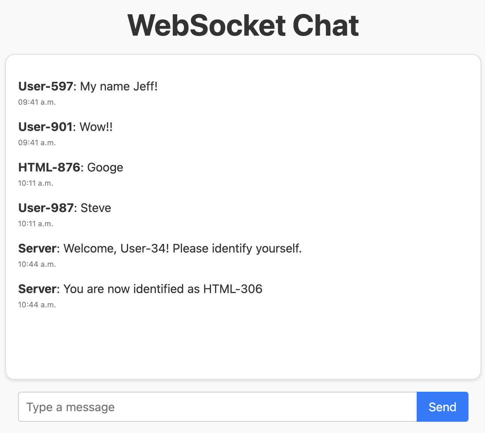
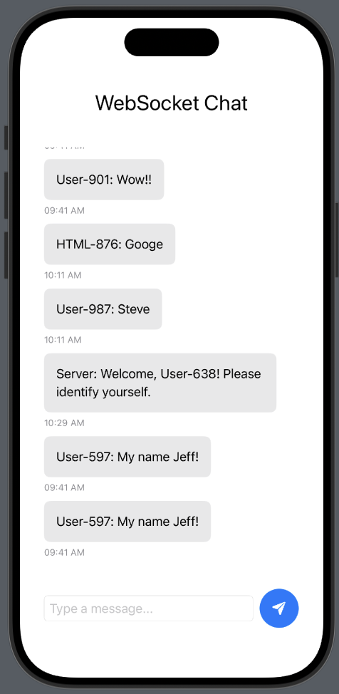

# WebSocket Chat App

A lightweight, cross-platform chat prototype built using Node.js, WebSockets, and MongoDB.  

It enables real-time communication between a SwiftUI iOS client and a browser-based HTML client.

The HTML client was initially created for testing backend functionality, and later evolved to interoperate seamlessly with the SwiftUI client.

---

## Preview

**Web Client**  



**SwiftUI Client**  


---

## Features

- Real-time messaging via WebSockets
- SwiftUI and browser-based clients
- Message persistence using MongoDB
- Timestamps and basic identity handshake
- Decoupled, modular backend structure:
  - `server.js` – Entry point
  - `socketHandler.js` – WebSocket logic
  - `messageService.js` – DB interactions

---

## Getting Started

### Prerequisites

- [Node.js](https://nodejs.org/)
- [MongoDB](https://www.mongodb.com/) (running locally)

### Installation

```bash
git clone https://github.com/your-username/websocket-chat-app.git
cd websocket-chat-app
npm install
```

## Running the App

```bash 
npm start
```

Then, visit the web client:

```bash
http://localhost:8080
```
(or run the SwiftUI client in Xcode using ContentView.swift)

## Notes
- This app assumes a local MongoDB instance is available
- The WebSocket protocol uses a simple initial handshake (username, clientType) for basic identification.

---